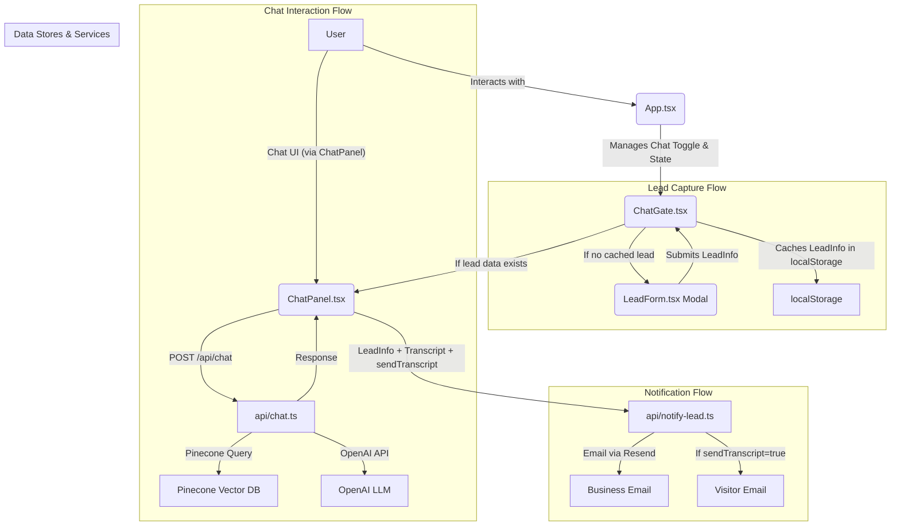

# Skypearls Villas RAG Chatbot — Technical Documentation

## Overview

The Skypearls Villas RAG (Retrieval-Augmented Generation) Chatbot is a full-stack, production-grade conversational assistant for luxury real estate. It leverages OpenAI LLMs, Pinecone vector search, and a React/Tailwind UI to answer user questions, surface villa information, and capture qualified leads through a pre-chat form.

---

## System Architecture



---

## Data Flow

1. **Villa Content Ingestion**
   - Markdown files in `docs/villas/` (e.g., `villa-anna.md`) contain property data.
   - `scripts/ingest.ts` splits, embeds, and upserts these documents into Pinecone using OpenAI embeddings.

2. **Lead Capture (Pre-Chat)**
   - User clicks the chat toggle button in `App.tsx`.
   - `ChatGate.tsx` checks `localStorage` for existing lead information (`skypearls_lead`).
   - If no valid lead info is found, `LeadForm.tsx` is displayed as a modal.
   - User submits their `firstName`, `email`, `phone`, and `sendTranscript` preference.
   - On submission, `LeadForm.tsx` passes the data to `ChatGate.tsx`.
   - `ChatGate.tsx` stores the `LeadInfo` in `localStorage` and then mounts `ChatPanel.tsx`, passing the `LeadInfo`.
   - Returning visitors with valid `LeadInfo` in `localStorage` bypass the form.

3. **User Interaction (Chat)**
   - `ChatPanel.tsx` (now receiving `LeadInfo`) provides the chat UI.
   - The initial greeting is personalized with the user's first name.
   - User messages are sent to `/api/chat` as `{ messages: ChatMessage[] }`.

4. **RAG Pipeline**
   - `/api/chat.ts` validates input (Zod), retrieves relevant villa chunks from Pinecone, and calls OpenAI.
   - The LLM response is returned to the client.

5. **Lead Notification & Transcript Emailing**
   - After the first successful bot interaction (if `sendTranscript` is true), or at another defined trigger point (e.g., chat close), `ChatPanel.tsx` POSTs `{ lead: { firstName, email, phone }, transcript, sendTranscript }` to `/api/notify-lead.ts`.
   - `/api/notify-lead.ts` validates the data. It always emails the lead details and transcript to the business.
   - If `sendTranscript` is `true` and the visitor's email is provided, it also sends a copy of the transcript to the visitor via Resend.

---

## Key Files & Modules

- **Content**: `docs/villas/*.md` — Markdown villa data
- **Ingestion**: `scripts/ingest.ts` — Pinecone ingestion script
- **Chat API**: `api/chat.ts` — RAG endpoint (OpenAI + Pinecone)
- **Lead API**: `api/notify-lead.ts` — Lead email endpoint
- **UI Components**:
  - `src/components/LeadForm.tsx` — **NEW** Modal form for lead capture.
  - `src/components/ChatGate.tsx` — **NEW** Wrapper to manage lead form display and persistence.
  - `src/components/ChatPanel.tsx` — Floating chat widget, now receives lead info as props.
- **Integration**: `src/App.tsx` — Injects `<ChatGate />` (which renders `<ChatPanel />`) globally and manages chat toggle state.
- **Types**: `src/types.ts` — Contains shared `LeadInfo` interface.

---

## API Contracts

### `/api/chat` (POST)
- **Request**: `{ messages: ChatMessage[] }`
  - `ChatMessage`: `{ role: 'user' | 'assistant' | 'system', content: string }`
- **Response**: `{ reply: string }`
- **Validation**: Zod schema, rejects invalid/missing fields

### `/api/notify-lead` (POST)
- **Request**: 
  ```json
  {
    "lead": {
      "firstName": "string",
      "email": "string (email format)",
      "phone": "string"
    },
    "transcript": "string",
    "sendTranscript": "boolean (optional)"
  }
  ```
- **Response**: `{ ok: true, message?: string }` or error object
- **Validation**: Zod schema. `lead.firstName`, `lead.email`, `lead.phone`, and `transcript` are required. `sendTranscript` is optional.

---

## Environment Variables

Required in `.env` and Vercel:

```
# OpenAI
OPENAI_API_KEY=sk-...
OPENAI_MODEL=gpt-4o-mini

# Pinecone
PINECONE_API_KEY=pc-...
PINECONE_ENV=us-east-1
PINECONE_INDEX=skypearls-vectors

# Lead email (Resend)
RESEND_API_KEY=re_...
LEAD_EMAIL_TO=business_address@example.com
LEAD_EMAIL_FROM=noreply@yourdomain.com # Optional, defaults to ivanxdigital@gmail.com
LEAD_REPLY_TO=sales@yourdomain.com    # Optional, defaults to ivanxdigital@gmail.com
```

---

## Implementation Notes

- **Type Safety**: All endpoints and UI use TypeScript strict mode. Zod is used for runtime validation.
- **Lead Capture Flow**: The new pre-chat lead capture flow ensures `firstName`, `email`, and `phone` are collected before the chat session begins. This data is persisted in `localStorage` to improve UX for returning visitors.
- **UI**: `ChatGate.tsx` orchestrates the display of `LeadForm.tsx` or `ChatPanel.tsx`. `ChatPanel.tsx` receives `LeadInfo` as a prop and personalizes the greeting. Chat history is stored in `localStorage` and is now only loaded if it matches the current lead's first name.
- **Transcript Emailing**: The `/api/notify-lead.ts` endpoint now optionally sends the chat transcript to the visitor if `sendTranscript` is true in the request payload.
- **Chunking**: Markdown villa files are split into ~800-character chunks with 100 overlap for optimal retrieval.
- **Retrieval**: 
    - Pinecone is queried for top-4 relevant chunks per user question.
    - **Namespace Consistency**: Crucial for Pinecone operations.
- **LLM & LangChain Configuration (`api/chat.ts`)**: No changes in this update.
- **Testing & Debugging Retrieval**: No changes in this update.
- **Vercel Deployment**: No changes in this update.

---

## Extension Points

- **Add More Villas**: Drop new `.md` files in `docs/villas/` and re-run `node scripts/ingest.ts`.
- **Custom Prompts**: Adjust system prompt or chain config in `api/chat.ts` for tone/behavior.
- **CRM Integration**: Extend `/api/notify-lead.ts` to store leads in Supabase or another backend.
- **UI Customization**: Refine `LeadForm.tsx` or `ChatPanel.tsx` for branding or advanced features.

---

## Example Villa Markdown

```
# Villa Anna – Skypearls Villas
**Total Contract Price:** ₱21,000,000
## Property Details
- Lot Area: 100 sqm
- Floor Area: 140 sqm
- Bedrooms: 2
- Bathrooms: 2 shower + 1 outdoor shower
- Private swimming pool
- Rooftop outdoor kitchen
- 1-car garage
- Fully furnished
## Smart Home Features
- Solar powered with backup generator
- Smart toilets
- Alexa voice commands
- Smart lock systems
- 24/7 security guards
- Homeowners Insurance included
## Payment Options
**Option 1:** 20% down, 80% bank financing (15–20 yrs)
**Option 2:** 30% down, 70% bank financing (15–20 yrs)
**Option 3:** 50% down + 10 % discount, 50% bank financing
**Option 4:** 100% cash – 15  % discount
**Option 5:** 40‑year lease; 30–50% down, 50–70% in‑house financing
```

---

## FAQ

- **How do I update villa info?**
  - Edit or add markdown files in `docs/villas/` and re-run the ingestion script.
- **How do I test the chatbot?**
  - Run `npm run dev`, open the site. New users will see the lead form. Interact with the chat widget. See `skypearls-rag-setup.md` for test cases.
- **How do I change the lead email recipient?**
  - Update `LEAD_EMAIL_TO` in your environment variables.
- **How do I change the sender/reply-to for lead emails?**
  - Update `LEAD_EMAIL_FROM` and `LEAD_REPLY_TO` in your environment variables.

---

## References
- See `skypearls-rag-setup.md` for setup and task breakdown.
- See `project-brief.md` for overall project context. 
- See `docs/pre-chat-lead-prd.md` for the Product Requirements Document for this feature. 