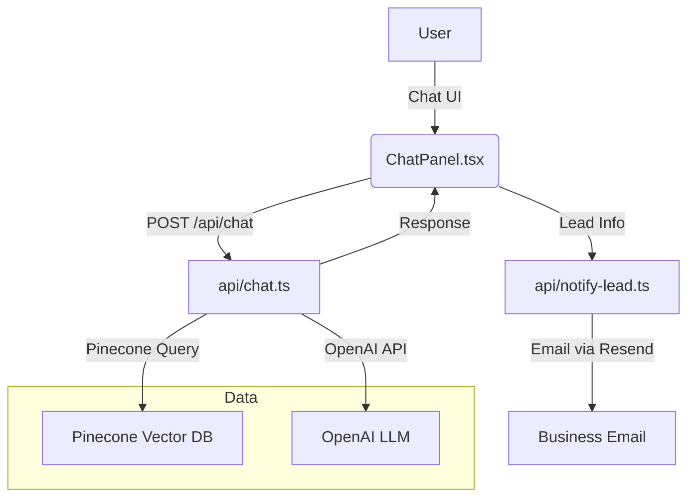

# Skypearls Villas RAG Chatbot — Technical Documentation

## Overview

The Skypearls Villas RAG (Retrieval-Augmented Generation) Chatbot is a full-stack, production-grade conversational assistant for luxury real estate. It leverages OpenAI LLMs, Pinecone vector search, and a React/Tailwind UI to answer user questions, surface villa information, and capture qualified leads.

---

## System Architecture



---

## Data Flow

1. **Villa Content Ingestion**
   - Markdown files in `docs/villas/` (e.g., `villa-anna.md`) contain property data.
   - `scripts/ingest.ts` splits, embeds, and upserts these documents into Pinecone using OpenAI embeddings.

2. **User Interaction**
   - The floating `<ChatPanel />` React component (injected in `src/App.tsx`) provides a persistent chat UI on all pages.
   - User messages are sent to `/api/chat` as `{ messages: ChatMessage[] }`.

3. **RAG Pipeline**
   - `/api/chat.ts` validates input (Zod), retrieves relevant villa chunks from Pinecone, and calls OpenAI via LangChain's `ConversationalRetrievalQAChain`.
   - The LLM response is returned to the client.

4. **Lead Capture**
   - The chat UI detects when the bot requests or receives name, email, and phone.
   - On "✅ Lead captured", the client POSTs `{ lead, transcript }` to `/api/notify-lead`.
   - `/api/notify-lead.ts` validates and emails the lead to the business via Resend.

---

## Key Files & Modules

- **Content**: `docs/villas/*.md` — Markdown villa data
- **Ingestion**: `scripts/ingest.ts` — Pinecone ingestion script
- **Chat API**: `api/chat.ts` — RAG endpoint (OpenAI + Pinecone)
- **Lead API**: `api/notify-lead.ts` — Lead email endpoint
- **UI**: `src/components/ChatPanel.tsx` — Floating chat widget
- **Integration**: `src/App.tsx` — Injects `<ChatPanel />` globally

---

## API Contracts

### `/api/chat` (POST)
- **Request**: `{ messages: ChatMessage[] }`
  - `ChatMessage`: `{ role: 'user' | 'assistant' | 'system', content: string }`
- **Response**: `{ reply: string }`
- **Validation**: Zod schema, rejects invalid/missing fields

### `/api/notify-lead` (POST)
- **Request**: `{ lead: { name: string, email: string, phone: string }, transcript: string }`
- **Response**: `{ ok: true }` or error object
- **Validation**: Zod schema, all fields required

---

## Environment Variables

Required in `.env` and Vercel:

```
# OpenAI
OPENAI_API_KEY=sk-...
OPENAI_MODEL=gpt-4o-mini

# Pinecone
PINECONE_API_KEY=pc-...
PINECONE_ENV=us-east-1
PINECONE_INDEX=skypearls-vectors

# Lead email (Resend)
RESEND_API_KEY=re_...
LEAD_EMAIL_TO=ivanxdigital@gmail.com
```

---

## Implementation Notes

- **Type Safety**: All endpoints and UI use TypeScript strict mode. Zod is used for runtime validation.
- **Chunking**: Markdown villa files are split into ~800-character chunks with 100 overlap for optimal retrieval.
- **Retrieval**: Pinecone is queried for top-4 relevant chunks per user question.
- **LLM**: OpenAI GPT-4o (or mini) is used via LangChain's `ChatOpenAI`.
- **UI**: ChatPanel persists history in `localStorage` and auto-scrolls. It heuristically extracts lead info from user input.
- **Lead Capture**: Only triggers when all fields (name, email, phone) are present and not previously sent.
- **Testing**: See `skypearls-rag-setup.md` for manual and automated test steps.

---

## Extension Points

- **Add More Villas**: Drop new `.md` files in `docs/villas/` and re-run `node scripts/ingest.ts`.
- **Custom Prompts**: Adjust system prompt or chain config in `api/chat.ts` for tone/behavior.
- **CRM Integration**: Replace or extend `/api/notify-lead.ts` to store leads in Supabase or another backend.
- **UI Customization**: Refine `ChatPanel.tsx` for branding, animations, or advanced lead forms.

---

## Example Villa Markdown

```
# Villa Anna – Skypearls Villas
**Total Contract Price:** ₱21,000,000
## Property Details
- Lot Area: 100 sqm
- Floor Area: 140 sqm
- Bedrooms: 2
- Bathrooms: 2 shower + 1 outdoor shower
- Private swimming pool
- Rooftop outdoor kitchen
- 1-car garage
- Fully furnished
## Smart Home Features
- Solar powered with backup generator
- Smart toilets
- Alexa voice commands
- Smart lock systems
- 24/7 security guards
- Homeowners Insurance included
## Payment Options
**Option 1:** 20% down, 80% bank financing (15–20 yrs)
**Option 2:** 30% down, 70% bank financing (15–20 yrs)
**Option 3:** 50% down + 10 % discount, 50% bank financing
**Option 4:** 100% cash – 15  % discount
**Option 5:** 40‑year lease; 30–50% down, 50–70% in‑house financing
```

---

## FAQ

- **How do I update villa info?**
  - Edit or add markdown files in `docs/villas/` and re-run the ingestion script.
- **How do I test the chatbot?**
  - Run `npm run dev`, open the site, and interact with the chat widget. See `skypearls-rag-setup.md` for test cases.
- **How do I change the lead email recipient?**
  - Update `LEAD_EMAIL_TO` in your environment variables.

---

## References
- See `skypearls-rag-setup.md` for setup and task breakdown.
- See `project-brief.md` for overall project context. 